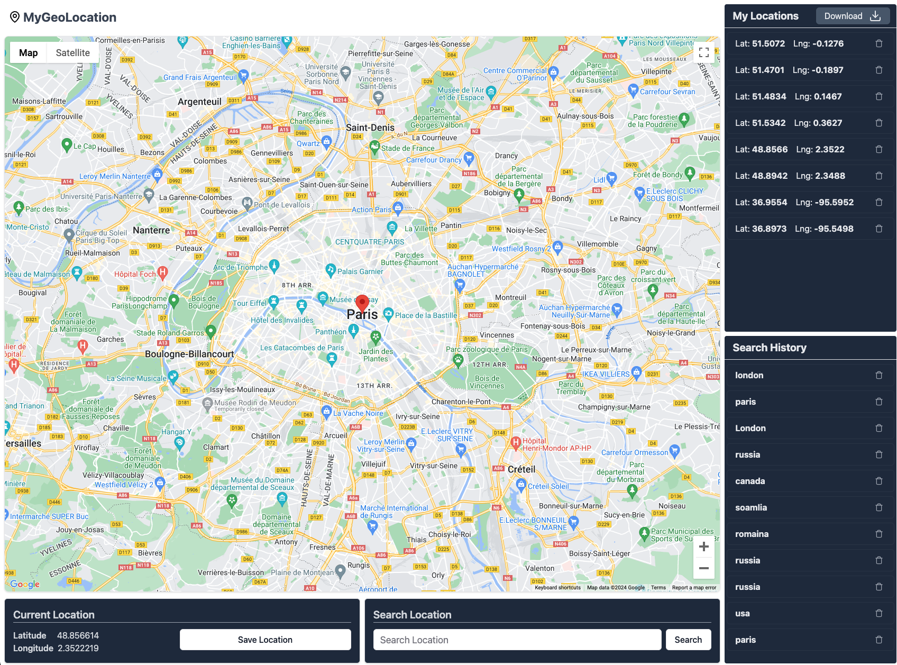

# MyGeoLocation App

This application uses the powerful capabilities of the new Google Maps JavaScript API package **@vis.gl/react-google-maps** to provide an interactive and feature-rich mapping experience.

### Visit the site: https://ashrafw.github.io/mygeolocation/

### github repo: https://github.com/Ashrafw/mygeolocation

To start the code: npm run dev

## CSS styling:

The primary styling framework throughout the project is Tailwind CSS and shadcn/ui.

## State Management

The application uses React-Redux and Redux Toolkit for robust and efficient state management.

## Functionalities

### 1. Search Functionality

- Explore and locate specific addresses, places, or points of interest on the map.
- Utilises the advanced features of the Google Maps API to ensure accurate and comprehensive search results (Geocoding.tsx).

### 2. Saving a Selected Location

- Mark and save points of interest or desired locations on the map.
- Easily revisit and share saved locations.

### 3. Search History

- Keep track of your past searches.
- Quickly access and revisit locations you've searched for in previous sessions.

### 4. Saved Locations

- Maintain a personalised list of your saved locations.
- Efficiently manage marked points on the map.

### 5. Option to Download Saved Locations in CSV Format

- Export all your saved locations to a CSV (Comma-Separated Values) file.
